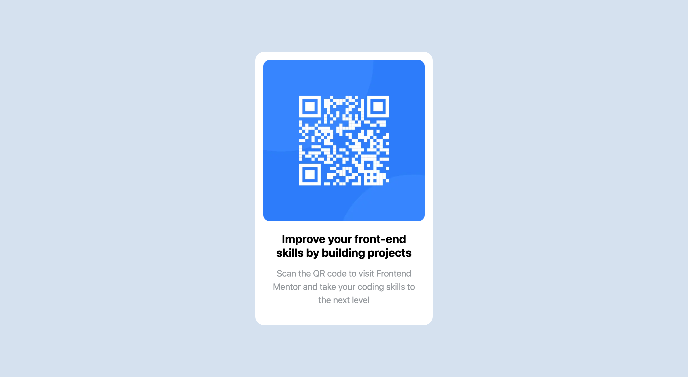

# Frontend Mentor - QR code component solution

This is a solution to the [QR code component challenge on Frontend Mentor](https://www.frontendmentor.io/challenges/qr-code-component-iux_sIO_H). Frontend Mentor challenges help you improve your coding skills by building realistic projects. 

## Table of contents

- [Overview](#overview)
  - [Screenshot](#screenshot)
  - [Links](#links)
  - [Built with](#built-with)
- [Author](#author)

## Overview

### Screenshot

### Links

- Solution URL: [Github](https://github.com/NeonNature/project-p-qr)
- Live Site URL: [Demo](https://animated-melba-903344.netlify.app/)

### Built with

- Semantic HTML5 markup
- CSS custom properties
- Flexbox
- Mobile-first workflow
- [React](https://reactjs.org/) - JS library
- [Next.js](https://nextjs.org/) - React framework
- [Tailwind CSS](https://tailwindcss.com/) - For styles

## Author

- Website - [Portfolio](https://www.voyager-neon.tech)
- Frontend Mentor - [@NeonNature](https://www.frontendmentor.io/profile/NeonNature)
- LinkedIn - [@Min Maung Maung](https://www.linkedin.com/in/min-maung-maung/)
